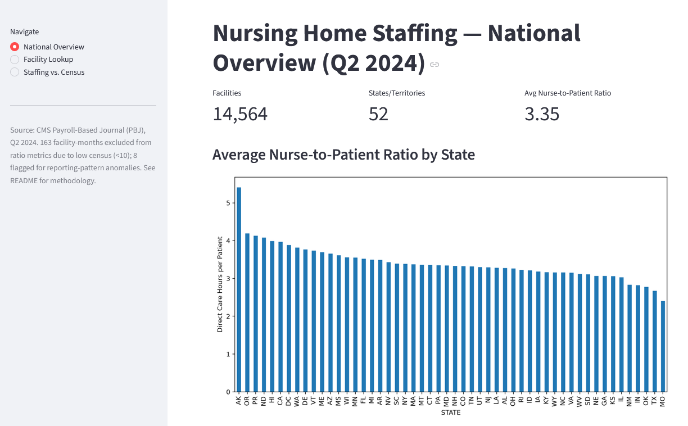
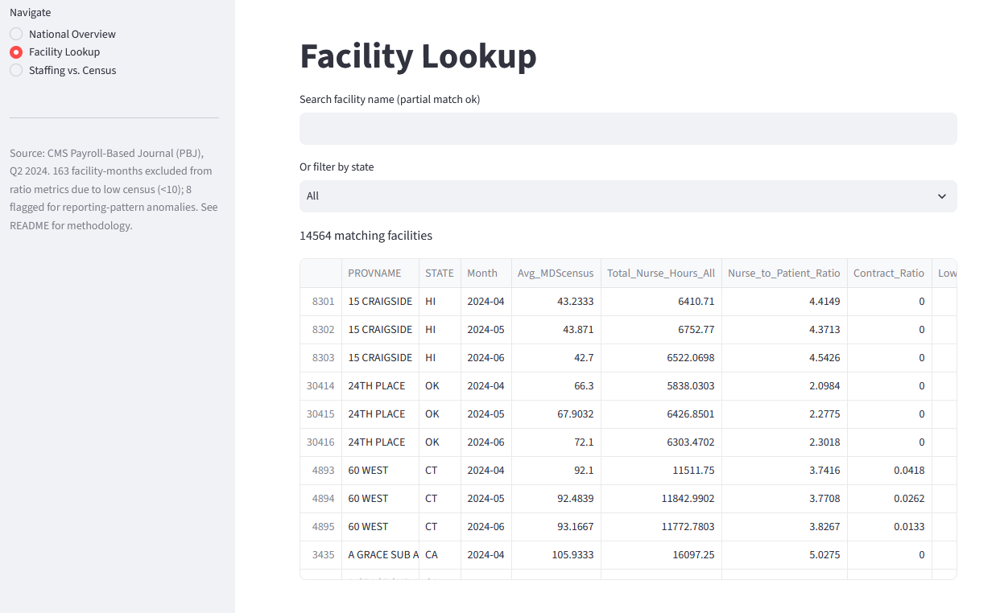
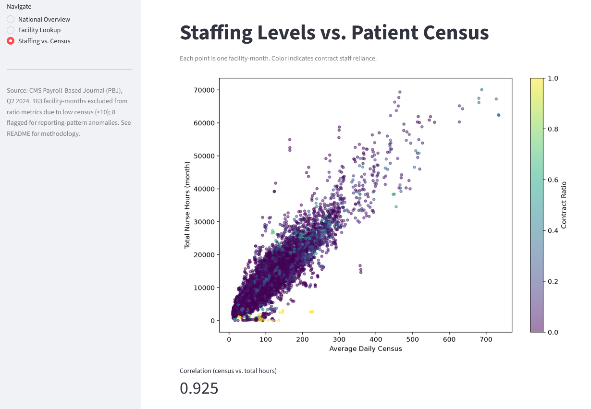

# Nurse Staffing Analysis — CMS Payroll-Based Journal (PBJ), Q2 2024

## Overview

This project analyzes daily nurse staffing levels at U.S. skilled nursing facilities (SNFs) using CMS's Payroll-Based Journal (PBJ) data for the second quarter of 2024. The goal was to understand how staffing hours relate to patient census, where staffing coverage is weakest, and how reliant different states are on contract nursing staff — then surface those findings in an interactive dashboard.

**Note on scope:** PBJ is nursing home / skilled nursing facility data, not hospital data. An earlier draft of this project's requirements referred to "hospitals" — that was a mislabeling I caught early on and corrected. The dataset covers 14,564 long-term care facilities, not acute-care hospitals.

## Data Source

- **Dataset:** CMS Payroll-Based Journal (PBJ) Daily Nurse Staffing, Q2 2024
- **Published by:** Centers for Medicare & Medicaid Services (CMS)
- **Download:** [https://catalog.data.gov/dataset/payroll-based-journal-daily-nurse-staffing](https://catalog.data.gov/dataset/payroll-based-journal-daily-nurse-staffing) (also available via the [CMS Provider Data Catalog](https://data.cms.gov/))
- **Data dictionary:** included in `docs/NH_Data_Dictionary.pdf` (CMS-published)

**What's actually in the file:**
- 1,325,324 rows — one row per facility, per calendar day
- 14,564 unique facilities across 52 states/territories
- Full quarter coverage: April 1 – June 30, 2024 (91 days), with every facility reporting all 91 days
- 33 raw columns: facility identifiers/location, daily patient census (`MDScensus`), and paid staffing hours broken out by role (RN, LPN, CNA, plus administrative/DON/training/medication-aide categories) and by employment type (employed vs. contract)
- Facilities are legally required to submit this data under the Affordable Care Act (Section 6106), based on actual payroll records — so it's a more auditable, granular source than self-reported survey data

## Key Findings

1. **Staffing and patient census are strongly correlated (r = 0.925).** Larger facilities generally staff up accordingly — but similarly sized facilities can still show meaningfully different staffing intensity, meaning size alone doesn't fully explain staffing decisions.
2. **Isabella Geriatric Center (NY) and Coler Rehabilitation and Nursing Care Center (NY)** logged the highest total nurse hours of any facility in the quarter — both are large, high-census facilities, so this tracks with finding #1.
3. **Average nurse hours per facility vary widely by state** — New York (17,813 hrs/month) and DC (15,402 hrs/month) are highest; Iowa (5,754) and South Dakota (5,865) are lowest (Puerto Rico excluded — only 6 facilities, too small a sample to trust). Note this is a different question from raw state totals: California has the most *total* hours of any state simply because it has the most facilities (1,142), but drops to 7th once normalized per facility.
4. **Missouri has the lowest average nurse-to-patient ratio of any state** (2.45 direct-care hours per patient, vs. a 3.37 national average), followed by Texas (2.73) and Oklahoma (2.79). This held up after excluding facility-months flagged for unreliable data (only 10 of Missouri's 1,425 facility-months were flagged), so it reflects a real pattern rather than a data artifact. I don't have data on *why* — regional wage differences, state Medicaid reimbursement rates, and staffing regulations are all plausible contributors, but that's outside what this dataset can answer.
5. **Vermont relies most heavily on contract nursing staff; Alabama the least.** States with heavier contract reliance may be more exposed to staffing volatility, though this dataset alone can't confirm cause.

## Methodology & Key Decisions

A few choices in this analysis required real judgment calls, not just default settings — documenting them here so the reasoning is checkable, not just the output.

**"Direct care hours" is defined as RN + LPN + CNA hours only** — it excludes Director of Nursing, RN/LPN administrative hours, nurse aides in training, and medication aide hours. The reasoning: DON and admin roles handle oversight, not bedside care, so including them would inflate the nurse-to-patient ratio beyond what patients actually experience. This decision has a real limitation, though — one facility (White River Healthcare, AR) showed *zero* RN/LPN/CNA hours for three straight months while reporting substantial RNDON and RNadmin hours instead. That facility wasn't unstaffed; it was staffed through roles this definition excludes. This is flagged in the data (see "Reliability flags" below) rather than hidden or silently included.

**Ratios are calculated on summed monthly totals, not averaged daily ratios.** For each facility-month, I summed direct-care hours and summed patient-census across all days, then divided once — rather than computing a ratio for each day and averaging those. Averaging daily ratios would give a 5-patient day the same statistical weight as a 500-patient day, which misrepresents a facility's actual coverage. Summing first weights each day by its real size.

**One data quality correction was made and documented, not silently applied.** A single row (Marigold Rehabilitation HCC, Illinois, 2024-05-25) had an implausible `Hrs_LPN_ctr` value of 13,801.5 hours in one day — physically impossible for a single facility-day. The employed-LPN-hours figure on that same row was normal, so this was treated as an isolated data entry error. Rather than deleting the row (which would also discard valid RN/CNA/census data for that facility-day), only the corrupted LPN value was set to null.

**Reliability flags protect the ratio metric from misleading edge cases.** Two patterns can make the nurse-to-patient ratio meaningless even though the underlying numbers are technically "correct":
- **Low census** (average daily census under 10 residents) — a ratio calculated on 2-3 patients is statistically noisy and can swing wildly (one facility-month showed a ratio of 217 driven by an average census of 0.03).
- **Zero direct-care hours despite nonzero total hours** — the White River pattern described above.

163 of 43,692 facility-months (0.4%) were flagged for low census, and 8 for the zero-direct-care pattern. Both groups are retained in the data but excluded from ratio-based rankings and averages in the dashboard.

**320 zero-census rows** (days where a facility reported zero patients) were kept in the dataset for hours-based analysis but excluded specifically from ratio calculations, since dividing by zero census is undefined.

## Project Structure

```
nurse-staffing-analysis/
├── data/
│   ├── raw/                          # place PBJ_Daily_Nurse_Staffing_Q2_2024.csv here (not tracked in git)
│   └── processed/                    # cleaned data + aggregated summary tables
├── docs/
│   └── NH_Data_Dictionary.pdf        # CMS-published data dictionary
├── notebooks/
│   └── 04_analysis_exploration.ipynb # exploratory analysis behind the key findings
├── src/
│   ├── 01_load_and_inspect.py        # initial EDA: schema, missing values, duplicates, outliers
│   ├── 02_clean_data.py              # datetime conversion, outlier correction, derived columns
│   └── 03_calculate_metrics.py       # facility-month and state-month aggregations, ratio metrics
├── dashboard/
│   └── app.py                        # Streamlit dashboard (3 pages)
├── requirements.txt
├── .gitignore
└── README.md
```

## How to Run

1. Download `PBJ_Daily_Nurse_Staffing_Q2_2024.csv` from the [CMS data source](https://catalog.data.gov/dataset/payroll-based-journal-daily-nurse-staffing) above and place it in `data/raw/`.
2. Set up the environment:
   ```bash
   python -m venv venv
   source venv/bin/activate      # Windows: venv\Scripts\activate
   pip install -r requirements.txt
   ```
3. Run the pipeline in order:
   ```bash
   python src/01_load_and_inspect.py     # optional — prints EDA summary, doesn't save anything
   python src/02_clean_data.py           # produces data/processed/pbj_q2_2024_cleaned.parquet
   python src/03_calculate_metrics.py    # produces facility_month_summary.parquet + state_month_summary.parquet
   ```
4. Launch the dashboard:
   ```bash
   streamlit run dashboard/app.py
   ```

## Dashboard

The dashboard has three pages:
- **National Overview** — state-by-state comparison of nurse-to-patient ratio, contract reliance, and hours per facility
- **Facility Lookup** — search any facility by name or filter by state, with a quarter-long trend chart
- **Staffing vs. Census** — scatter plot of the hours-census relationship across all facilities, colored by contract reliance





## Known Limitations

- **Single quarter only.** This covers Q2 2024 exclusively — no year-over-year or seasonal trend is possible from this file alone. CMS publishes PBJ data quarterly, so this could be extended by pulling additional quarters.
- **"Direct care hours" is one reasonable definition, not the only one.** As shown by the White River case, some facilities report real nursing coverage through administrative-coded hours that this definition excludes. State/national ratio comparisons should be read as directionally meaningful, not as precise clinical staffing assessments.
- **State-level rankings can be sensitive to facility count in small states/territories.** Puerto Rico (6 facilities) was excluded from per-facility rankings for this reason; other small-N states/territories should be read cautiously.
- **Correlation is not causation.** The staffing-census relationship (question 1) and the state-level ratio differences (question 4) are observed patterns, not explanations — this dataset doesn't include information on staffing regulations, wages, or facility ownership that would be needed to explain *why* these patterns exist.

## Tech Stack

Python, pandas, PyArrow, Streamlit, Matplotlib

---

*Data source: Centers for Medicare & Medicaid Services (CMS), Payroll-Based Journal Public Use Files. This is public government data; no permission is required for reuse. This project is independent analysis and is not affiliated with or endorsed by CMS or HHS.*
